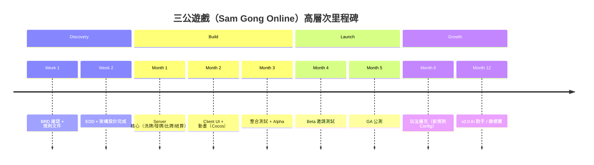

# BRD — 三公遊戲（Sam Gong Online）

<!-- SDLC Requirements Engineering — Layer 1：Business Requirements -->

---

## Document Control

| 欄位 | 內容 |
|------|------|
| **DOC-ID** | BRD-SAM-GONG-GAME-20260421 |
| **專案名稱** | 三公遊戲（Sam Gong Online — Cocos + Colyseus） |
| **文件版本** | v0.1-draft |
| **狀態** | DRAFT |
| **作者** | tobala（由 /devsop-idea 自動生成） |
| **日期** | 2026-04-21 |
| **建立方式** | /devsop-idea 自動生成，請執行 /devsop-brd-review 審查 |

---

## Change Log

| 版本 | 日期 | 作者 | 變更摘要 |
|------|------|------|---------|
| v0.1-draft | 2026-04-21 | /devsop-idea | 初稿，由 AI 自動生成 |

---

## §0 背景研究（/devsop-idea 自動蒐集）

### 競品 / 參考資源

| 競品 / 工具 | 核心定位 | 優勢 | 劣勢 | 我們的差異 |
|-----------|---------|------|------|-----------|
| node-poker-stack (GitHub) | Node.js 撲克遊戲伺服器 + HTML5 前端 | 開源、完整 Poker 邏輯 | 無 Cocos 整合、無 Colyseus、無三公規則 | 採用 Colyseus 高階狀態同步 + Cocos 豐富 UI |
| distributed-texasholdem | Socket.IO + Express 德州撲克 | 即時架構示範完整 | 無驗證邏輯、易作弊 | Server-authoritative 比牌，牌面不提前洩漏 |
| colyseus/cocos-demo-tictactoe | Cocos Creator + Colyseus 官方 Demo | 官方示範、架構清晰 | 僅 Tic Tac Toe，無金融下注邏輯 | 以此為基礎架構，擴充三公牌局 + 下注狀態機 |

### 技術建議

| 層次 | 建議方案 | 選擇理由 |
|------|---------|---------|
| Client 框架 | Cocos Creator 4.x + TypeScript | 使用者指定；官方有 Colyseus SDK 整合文件 |
| Server 框架 | Colyseus 0.15+ + Node.js | MIT 授權；天然 authoritative 設計；官方有 Cocos SDK |
| Server 語言 | TypeScript（ts-node / esbuild 打包） | 與 Client 統一語言，共享型別定義 |
| 狀態同步 | Colyseus Schema（@colyseus/schema） | 自動差分同步，減少 bandwidth |
| 資料庫 | Redis（房間狀態快取）+ PostgreSQL（玩家帳戶、戰績） | 小規模初期可只用 Redis |

### 已知風險

1. **牌面資訊提前洩漏（反作弊核心）**：伺服器不得在揭牌前將完整牌組資訊發送至 Client，否則改封包即可看牌。
2. **同謀攻擊（Collusion）**：2-6 人房間中，若多位玩家共謀分享手牌資訊可獲利；需設計異常下注行為偵測。
3. **Colyseus + Cocos Creator 版本相容性**：Colyseus SDK 版本需與 Cocos Creator 版本嚴格對應，升級需測試。
4. **斷線重連（Reconnect）**：玩家斷線後需在指定時間內重連，否則系統需自動棄牌/結算，避免房間卡死。

---

## 1. Executive Summary（PR-FAQ 風格）

### 1.1 假設新聞稿

> **標題：** 全新線上三公平台上線，支援即時多人 2-6 人對戰，反作弊機制全面保障公平牌局
>
> **第一段（What & Who）：** 「三公遊戲（Sam Gong Online）」是一款以 Cocos Creator 打造豐富前端動畫、以 Colyseus 確保 Server-Authoritative 公正比牌的即時多人線上三公棋牌遊戲。目標玩家為熟悉三公規則的 2-6 人休閒棋牌玩家。
>
> **第二段（Why Now）：** 目前市場上缺乏高品質、開放架構的線上三公平台。現有解決方案要嘛介面粗糙、要嘛依賴客戶端計算牌型（容易作弊），或缺乏完整的動畫與互動體驗。Cocos Creator 生態與 Colyseus 框架日趨成熟，使高品質線上三公開發成本大幅降低。
>
> **第三段（How It Works）：** 1) 玩家進入房間，系統自動完成洗牌並在 Server 保管牌堆；2) 下注完成後，Server 發牌並同步玩家各自的手牌（其他人的牌不洩漏）；3) 比牌時 Server 計算所有牌型勝負，結算籌碼，Client 只負責呈現動畫與結果。
>
> **用戶引言：** 「終於有一個可以和朋友線上玩三公的平台了，介面也夠漂亮！」— 假設 Persona：阿明，35 歲，棋牌愛好者

### 1.2 FAQ

| 問題 | 回答 |
|------|------|
| 為什麼現在做這個？ | Cocos + Colyseus 生態成熟，三公線上化需求存在但市場空白 |
| 為什麼是我們來做？ | 技術棧（Cocos + Colyseus）已選定，對三公規則有深入理解 |
| 最大的風險是什麼？ | 反作弊設計不完善，導致玩家信任破壞 |
| 如果失敗，原因最可能是？ | 規則實作與使用者預期不符，或網路體驗不佳（斷線問題） |
| 競品為什麼沒做？ | 三公規則地區性強，主流棋牌廠商優先做德州撲克、百家樂 |

---

## 2. Problem Statement

### 2.1 現狀描述

三公是台灣、東南亞地區廣受歡迎的傳統棋牌遊戲，通常需要 2-6 人實體聚會進行。線上版本的主要問題：
- 缺乏高品質 UI/UX 的三公專屬平台
- 現有解法（LINE 群組 + 人工記帳）易出錯、無法即時
- 非法或灰色地帶的線上平台缺乏公正機制，牌型計算可能由 Client 執行（易作弊）

### 2.2 根本原因（5 Whys）

```
問題現象：玩家無法方便地線上遊玩高品質三公
  Why 1：市場上缺乏高品質三公線上平台
    Why 2：三公規則地區性強，主流廠商未投入
      Why 3：開發成本與市場規模比例不划算（對大廠而言）
        Why 4：缺乏合適的技術框架快速開發即時多人棋牌
          Why 5（根本原因）：Colyseus 等即時框架的普及使小團隊也能打造高品質即時棋牌 ← 現在正是時機
```

### 2.3 問題規模（量化）

| 指標 | 數據 | 來源 |
|------|------|------|
| 受影響用戶數 | 估計 50,000+ 三公愛好者（台灣 + 海外華人） | AI 推斷，待驗證 |
| 每次聚會損失協調時間 | ~30 分鐘 | AI 推斷 |
| 市場規模（TAM）| 線上棋牌休閒遊戲市場（亞太）數十億美元 | AI 推斷 |
| 可服務市場（SAM）| 三公/中式撲克利基市場，估 $5M-$50M | AI 推斷 |
| 可獲取市場（SOM）| 初期 1,000-10,000 DAU 目標 | AI 推斷 |

---

## 3. Business Objectives

### 3.1 商業目標

| # | 目標 | 量化指標 | 時間框架 | 優先度 |
|---|------|---------|---------|--------|
| O1 | 打造完整可玩的三公遊戲核心 | Alpha：2-6 人完整牌局可玩，P0 Bug = 0 | 3 個月 | Must |
| O2 | 驗證玩家留存率 | Beta：7 日留存率 ≥ 20%（GA 目標 ≥ 30%）| 6 個月 | Should |
| O3 | 技術架構可擴展至其他棋牌 | 架構文件 + 模組化牌型引擎可複用 | 6 個月 | Could |

### 3.2 與公司策略的對應

| 策略目標 | 本專案如何貢獻 |
|---------|-------------|
| 建立即時多人遊戲技術能力 | Colyseus + Cocos 整合 know-how 可複用 |
| 驗證休閒棋牌市場 | 三公作為試金石，了解玩家留存與付費意願 |

### 3.3 投資報酬分析（3 情境）

| 項目 | 悲觀（-30%）| 基準 | 樂觀（+30%）|
|------|-----------|------|-----------|
| 開發成本 | NT$ 600K | NT$ 450K | NT$ 300K |
| Alpha 完成週期 | 5 個月 | 3 個月 | 2 個月 |
| 6M MAU | 500 | 2,000 | 5,000 |
| Payback Period | 24 個月 | 12 個月 | 6 個月 |

### 3.4 Requirements Traceability Matrix（RTM）

| 業務目標 | 成功指標 | 功能需求（PRD REQ-ID）| 測試覆蓋 | 狀態 |
|---------|---------|---------------------|---------|------|
| O1：完整牌局可玩 | Alpha P0 Bug = 0（§7） | REQ-001~010 | BDD Scenario S-001~010 | 🔲 待填 |
| O2：7日留存 ≥ 30% | Beta 7D Retention（§7） | REQ-011~020 | BDD Scenario S-011~015 | 🔲 待填 |
| O3：架構可複用 | 模組化牌型引擎文件完整度 ≥ 80% | REQ-021~025 | 架構審查 | 🔲 待填 |

### 3.5 Benefits Realization Plan

| 效益 | 基準值（Pre-launch）| 目標值 | 測量時間點 | 測量方式 | 負責人 | 若未達標的行動 |
|------|:------------------:|:-----:|----------|---------|--------|--------------|
| 完整牌局可玩率 | 0% | 100%（P0 Bug=0）| Alpha 完成時 | QA 測試報告 | Engineering | 延長 Bug Fix Sprint |
| 7 日留存率 | N/A | ≥ 30% | Beta Launch + 7D | Analytics | PM | 用戶訪談 → 玩法調整 |
| 平均局數/日/活躍用戶 | N/A | ≥ 5 局 | GA + 30D | Analytics | PM | 縮短局時 or 加入快速模式 |

---

## 4. Stakeholders & Users

### 4.1 Target Users

| 用戶群 | 規模估算 | 核心需求 | 目前解法 | 痛點 |
|--------|---------|---------|---------|------|
| 三公愛好者（2-6 人組） | 50,000+（台灣 + 海外華人）| 即時公正的線上三公牌局 | LINE 群組 + 人工記帳 | 不公正、無動畫、易出錯 |
| 棋牌遊戲開發者（次要）| 技術受眾 | 參考 Cocos + Colyseus 架構 | 官方 Demo 太簡單 | 缺乏完整棋牌案例 |

### 4.2 Not Our Users

- ❌ 德州撲克重度玩家（有大量成熟平台，不是我們定位）
- ❌ 賭博性質付費平台用戶（法律灰色地帶，不在本版本範圍）

### 4.3 Stakeholder Map

| 角色 | 職責 | 主要關切 |
|------|------|---------|
| Game Designer | 規則設計 + 玩法平衡 | 三公規則正確性、下注體驗 |
| Engineering Lead | Client + Server 實作 | 技術架構、Colyseus 版本相容 |
| UI/UX Designer | Cocos 介面設計 | 動畫品質、像素風格/Casino 風格 |
| QA Lead | 測試 | 反作弊驗證、斷線重連、並發測試 |

### 4.4 RACI Matrix

| 活動 | Game Designer | Engineering | UI/UX | QA |
|------|:------------:|:-----------:|:-----:|:--:|
| 規則設計 | A/R | C | I | I |
| 技術架構 | C | A/R | I | I |
| UI 設計審查 | C | C | A/R | I |
| 反作弊測試 | I | C | I | A/R |
| 上線決策 | A | R | C | C |

---

## 5. Proposed Solution

### 5.1 解法概述

打造 Server-Authoritative 三公遊戲：
- **Server（Colyseus）**：持有所有牌組，執行洗牌、發牌、比牌、結算，絕不提前向 Client 洩漏他人牌面
- **Client（Cocos Creator）**：只做動畫呈現與玩家輸入，不做任何遊戲邏輯計算
- **通訊**：WebSocket + Colyseus Schema 差分同步

### 5.2 核心價值主張

**Customer Jobs：**
- Functional：在線上與 2-5 位朋友/陌生人玩三公牌局，規則正確、即時同步
- Emotional：享受發牌動畫、翻牌緊張感、籌碼增減的視覺回饋

**Pain Relievers：**
- Server 持牌，杜絕封包分析作弊
- 自動比牌結算，消除人工計算錯誤
- 豐富動畫（Cocos），媲美商業棋牌 App 體驗

### 5.3 解法邊界與 MoSCoW

**In Scope：**

| 功能 | MoSCoW | 對應目標 |
|------|--------|---------|
| 2-6 人房間建立/加入 | Must Have | O1 |
| Server 洗牌 + 發牌（防作弊）| Must Have | O1 |
| 三公規則比牌 + 結算引擎 | Must Have | O1 |
| 下注流程（押注/跟注/棄牌）| Must Have | O1 |
| Cocos 發牌/翻牌/結算動畫 | Must Have | O1 |
| 斷線重連（60 秒窗口）| Must Have | O1 |
| 房間聊天（文字）| Should Have | O2 |
| 玩家頭像 + 暱稱 | Should Have | O2 |
| 戰績統計 | Could Have | O2 |
| 牌型 Config 化（可擴充規則）| Could Have | O3 |

**Out of Scope（明確排除）：**
- ❌ 真實金錢交易（法律風險，不在本版本）
- ❌ AI 電腦對手（複雜度高，推遲到 v2.0）
- ❌ 排行榜 / 錦標賽系統（超出 MVP 範圍）

---

## 6. Market & Competitive Analysis

### 6.1 競品分析

| 競品 | 優勢 | 劣勢 | 我們的差異化 |
|------|------|------|------------|
| node-poker-stack | 開源 Poker Server 完整 | 無三公規則、無 Cocos 整合 | Colyseus + Cocos 完整整合 |
| 市場上現有三公 App | 有玩家基礎 | 多為 Native App、閉源、部分有作弊疑慮 | Web/跨平台、反作弊透明架構 |
| Colyseus TicTacToe Demo | 官方架構示範 | 功能簡單，無棋牌完整邏輯 | 以此為起點，建立完整棋牌框架 |

### 6.2 市場定位

```
          企業/商業級
               │
               │  ○ 商業三公 App（閉源）
               │
               │         ● 本產品（開放架構 + 豐富 UI）
               │
開源/簡單 ───────┼──────────────── 豐富功能
               │
  ○ node-poker  │
    (無三公/UI)  │
               │
          個人/Demo 級
```

---

## 7. Success Metrics

### 7.1 北極星指標

**North Star：** 每週完成牌局數（Weekly Completed Games）

### 7.2 業務指標階層

```
Outcome：玩家持續回訪遊玩（7D Retention ≥ 30%）
  Output：每週完成牌局數 ≥ 1,000 局（Beta 後 30 天）
  Output：平均局時 10-15 分鐘（流暢體驗）
    Input：房間建立成功率 ≥ 99%
    Input：斷線率 ≤ 1% per 局
    Input：比牌結算正確率 100%（自動化測試驗證）
```

### 7.3 投資門檻（Go / No-Go）

| 里程碑 | 評估時間 | Go 條件 | No-Go 條件 | 決策者 |
|--------|---------|---------|-----------|--------|
| Alpha 驗收 | 開發 3M 後 | 完整牌局可玩，P0 Bug = 0 | P0 Bug ≥ 1 or 核心功能缺失 | Engineering + PM |
| Beta 驗收 | Alpha + 1M | 7D Retention ≥ 20%（Beta 目標）| 7D Retention < 10% | PM |
| GA 決策 | Beta + 1M | NPS ≥ 20，DAU ≥ 200 | NPS < 0 | PM |

---

## 8. Constraints & Assumptions

### 8.1 業務限制

| 限制 | 類型 | 影響 |
|------|------|------|
| Client：Cocos Creator 4.x + TypeScript | 硬性（使用者指定）| 所有 UI 技術選型基於此 |
| Server：Colyseus 0.15 + Node.js | 硬性（使用者指定）| Server 框架不可替換 |
| 不涉及真實金錢 | 硬性（法律）| 籌碼為虛擬，無真實金融接口 |
| 初期小規模 50-200 concurrent | 軟性 | 架構需可擴展但初期不必過度工程 |

### 8.2 關鍵假設（需驗證）

| # | 假設 | 驗證方式 | 若假設錯誤的影響 |
|---|------|---------|----------------|
| A1 | 玩家願意使用 Web-based 三公（非下載 App）| Beta 用戶調查 | 需考慮打包為 Native App |
| A2 | Cocos Creator Web Build 效能足夠移動端 | Alpha 效能測試 | 需評估 Native Build |
| A3 | Colyseus WebSocket 在 2-6 人規模無明顯延遲 | Alpha 壓力測試 | 需優化或考慮其他方案 |
| A4 | 初版目標平台為 Web（含 Mobile Web），不需 Native App | Alpha 用戶回饋 + Beta 流量分析 | 需追加 Cocos Native Build，影響測試和部署成本 |

---

## 9. Regulatory & Compliance Requirements

| 法規 / 標準 | 適用範圍 | 關鍵義務 | 負責人 |
|-----------|---------|---------|--------|
| 台灣個資法（個人資料保護法）| 玩家帳戶、遊戲紀錄 | 資料最小化、用戶同意 | Legal |
| 遊戲橘書（遊戲軟體分級）| 若上架平台 | 分級申請 | PM |
| GDPR（若服務歐洲用戶）| 玩家個資 | 資料主權 | Legal |

### 9.2 合規影響評估

| 合規要求 | 對產品設計的影響 | 對架構的影響 | 合規成本估算 |
|---------|--------------|------------|------------|
| 個資法 | 玩家資料蒐集最小化 | API 需加密傳輸（WSS）| 低 |
| 賭博法規（ROC §266）| 不得有真實金錢交易 | 籌碼系統純虛擬 | 低（已設計為虛擬）|

### 9.3 合規時程里程碑

| 里程碑 | 預計日期 | 負責人 | 狀態 |
|--------|---------|--------|------|
| 法律初步審查（虛擬幣設計）| BRD 審查後 2 週 | Legal | PENDING |
| DPIA（資料保護影響評估）| BRD 審查後 3 週 | Legal + PM | PENDING |
| 架構安全審查（WSS + 防作弊）| EDD 完成後 | Engineering | PENDING |
| 法規合規測試（個資法）| Beta 前 2 週 | QA + Legal | PENDING |

### 9.5 Data Governance

| 資料類型 | 資料擁有人 | 保留期限 | 存取控制 | 刪除程序 | 稽核需求 |
|---------|----------|---------|---------|---------|---------|
| 玩家帳戶（暱稱、頭像）| DPO | 帳戶存活期 | 玩家本人 | 帳戶刪除申請 | 個資法 |
| 牌局紀錄 | 系統 | 90 日 | 工程師核准 | 自動清理 | 內部審計 |
| WebSocket 連線日誌 | SRE | 30 日 | Engineering | 自動清理 | 安全審計 |

### 9.6 IP & Licensing

| 項目 | 內容 |
|------|------|
| OSS License | Colyseus（MIT）、Cocos Creator（自有授權）、@colyseus/schema（MIT）|
| 三公規則 | 傳統民間規則，無專利疑慮 |
| 美術資源 | 需確認像素風格素材授權（購買 or 自製） |
| IP 歸屬 | 產品 IP 歸開發團隊所有 |

---

## 10. Risk Assessment

| 風險 | 類型 | 可能性 | 影響 | 緩解策略 | 負責人 |
|------|------|--------|------|---------|--------|
| 牌面資訊提前洩漏 | 技術（反作弊）| MEDIUM | CRITICAL | Server 只在比牌時廣播完整牌面 + Schema 欄位加密 | Engineering |
| 同謀攻擊（Collusion）| 技術（公平性）| LOW | HIGH | 異常下注行為日誌分析 | Engineering |
| Colyseus 版本不相容 | 技術 | LOW | MEDIUM | 鎖定 Colyseus 0.15.x + Cocos SDK 特定版本 | Engineering |
| 斷線處理不完善 | 技術 | HIGH | HIGH | 60 秒重連窗口 + 自動棄牌規則 | Engineering |
| 三公規則理解差異 | 業務 | MEDIUM | HIGH | 完整規則文件 + 玩家內測確認 | PM |

---

## 11. Business Model

### 11.1 商業模式畫布

| 要素 | 內容 |
|------|------|
| **收入來源** | 初期免費，未來可考慮：皮膚/頭像付費、高級桌布、道具 |
| **定價策略** | 免費遊玩（Freemium）+ 虛擬道具微交易 |
| **成本結構** | 開發成本、Colyseus 伺服器運維、美術資源 |
| **核心資源** | Cocos + Colyseus 技術棧、三公遊戲邏輯引擎 |
| **關鍵活動** | 遊戲開發、Bug 修復、玩家社群維護 |
| **關鍵夥伴** | Cocos 官方、Colyseus 社群、雲端服務（AWS/GCP）|
| **獲客管道** | 社群媒體、口碑傳播、開源社群 |
| **Unit Economics** | CAC：接近 0（口碑）｜ LTV：取決於道具付費 |

### 11.2 商業模式假設驗證

| 假設 | 驗證方式 | 驗證期限 | 若錯誤的影響 |
|------|---------|---------|------------|
| 玩家願意長期留存 | 7D/30D Retention 監測 | Beta 30D | 調整玩法機制 |
| 道具付費意願存在 | Beta 期間調查 | Beta 結束後 | 調整商業模式 |

---

## 12. High-Level Roadmap



---

## 13. Dependencies

| 依賴項 | 類型 | 負責方 | 若延誤的影響 |
|--------|------|--------|------------|
| Cocos Creator 4.x SDK | 技術 | Cocos 官方 | Client 開發阻塞 |
| Colyseus 0.15+ | 技術 | Colyseus 社群 | Server 開發阻塞 |
| 像素風格美術素材 | 外部資源 | 美術設計師/採購 | UI 完成度延遲 |
| WebSocket 穩定雲端主機 | 基礎設施 | DevOps | 測試環境無法建立 |

### 13.1 Vendor & Third-Party Dependency Risk

| 供應商 / 服務 | 關鍵性 | 替代方案 | SLA 假設 | 若失敗的影響 | 退出計畫 |
|-------------|:-----:|---------|---------|------------|---------|
| Colyseus Framework | Tier 1（核心）| Socket.IO 自建（成本高）| 社群維護中 | 重大重構 | 遷移至自建 WS |
| Cocos Creator | Tier 1（核心）| Unity（學習曲線高）| 官方商業支援 | 重大重構 | 暫無可行替代 |
| AWS/GCP Compute | Tier 2（重要）| Azure 或自建 | 99.9% | 需切換雲端 | 30 天遷移 |

---

## 14. Open Questions

| # | 問題 | 影響層級 | 負責人 | 截止日 | 狀態 |
|---|------|---------|--------|--------|------|
| Q1 | 三公「公牌」特殊組合的完整規則定義（各地規則略有差異）| 策略 | Game Designer | BRD 審查後 1 週 | OPEN |
| Q2 | 斷線後超時自動棄牌的時間窗口（10s / 30s / 60s？）| 範圍 | Engineering + Game Designer | EDD 前 | OPEN |
| Q3 | 初版是否需要帳號系統（或匿名房間碼即可）？ | 範圍 | PM | BRD 審查後 | OPEN |
| Q4 | Cocos Creator 目標平台：Web only / Mobile Web / iOS+Android 原生？| 架構 | Engineering | EDD 前 | OPEN |

---

## 15. Decision Log

| # | 決策日期 | 議題 | 決策內容 | 決策依據 | 決策者 | 影響範圍 |
|---|---------|------|---------|---------|--------|---------|
| D1 | 2026-04-21 | BRD 初稿建立 | 以 /devsop-idea 自動生成 BRD | 加速 Discovery 階段 | AI | 全文件 |
| D2 | 2026-04-21 | 技術棧 | Cocos Creator + Colyseus（使用者明確指定）| 使用者決策 | tobala | 所有架構設計 |
| D3 | 2026-04-21 | 籌碼性質 | 虛擬籌碼，不涉及真實金錢 | 法律合規（ROC §266）| PM | 商業模式 |

---

## 16. Glossary

| 術語 | 業務定義 |
|------|---------|
| 三公（Sam Gong / 三公）| 中式三張牌棋牌遊戲（遊戲名稱本身）；以三張牌點數總和的個位數比大小，個位數越大越優，最大為 9。「三公」字面為「三張公牌」，代表最強牌型（見下方「公牌」）。 |
| 公牌（Gong / 公）| 三張牌點數總和能被 10 整除（個位數 = 0），為最強牌型。例：10+K+Q = 30，個位數 0 = 公牌。 |
| 牌點計算 | J/Q/K 算 10 點，A 算 1 點，2-9 照面值。三張牌加總後取個位數作為牌點（0-9）。 |
| Server Authoritative | 伺服器持有並計算所有遊戲狀態，客戶端只做呈現；其他玩家的牌在比牌前不得洩漏給任何 Client |
| Colyseus Schema | Colyseus 提供的可差分同步的狀態結構定義工具（@colyseus/schema）|
| Room（房間）| Colyseus 的多人遊戲房間單位，容納 2-6 位玩家 |
| 莊家（Banker）| 每局的莊家玩家，其他閒家與莊家單獨比牌輸贏籌碼 |
| 結算（Settlement）| 一局牌局結束後，依閒家 vs 莊家個別比牌結果，籌碼重新分配的過程 |
| 斷線重連（Reconnect）| 玩家網路中斷後在時間窗口內重新連入房間的機制（建議窗口：60 秒）|

---

## 17. References

- 背景研究：見 §0
- Colyseus 官方文件：https://docs.colyseus.io
- Colyseus Cocos SDK：https://docs.colyseus.io/getting-started/cocos
- Colyseus Cocos Demo：https://github.com/colyseus/cocos-demo-tictactoe
- 競品分析：見 §6
- 反作弊架構參考：Gabriel Gambetta Client-Server Game Architecture

---

## 18. BRD→PRD Handoff Checklist

### 18.1 Handoff 前置條件

| # | 確認項目 | 狀態 | 負責人 |
|---|---------|:----:|--------|
| H1 | BRD 已取得所有利害關係人核准 | 🔲 PENDING | PM |
| H2 | 北極星指標已確認（Weekly Completed Games）| ✅ | PM |
| H3 | 三公規則文件（含特殊牌型）已完整記錄 | 🔲 PENDING | Game Designer |
| H4 | Colyseus + Cocos 技術可行性已確認（PoC）| 🔲 PENDING | Engineering |
| H5 | Q3/Q4 Open Questions 已解答 | 🔲 PENDING | PM + Engineering |
| H6 | 虛擬籌碼法律確認 | 🔲 PENDING | Legal |
| H7 | PRD Owner 已指定 | 🔲 PENDING | PM |

### 18.2 移交文件

| 文件 | 存放位置 | 狀態 |
|------|---------|:----:|
| BRD.md（本文件）| docs/BRD.md | ✅ |
| IDEA.md（原始需求）| docs/IDEA.md | 🔲 生成中 |
| 背景研究（§0）| BRD §0 | ✅ |
| 競品分析（§6）| BRD §6 | ✅ |
| RTM 初稿（§3.4）| BRD §3.4 | 🔲 待 PRD REQ-ID |
| 技術限制清單（§8）| BRD §8 | ✅ |
| 風險清單（§10）| BRD §10 | ✅ |

---

## 19. Organizational Change Management

### 19.1 變革影響評估

| 受影響團隊 | 變革程度 | 主要影響 | 變革冠軍 |
|-----------|:-------:|---------|---------|
| Engineering | 高 | 引入 Colyseus + Cocos 新技術棧 | Engineering Lead |
| QA | 中 | 需學習即時多人遊戲測試方法 | QA Lead |

### 19.2 訓練計畫

| 目標群體 | 訓練內容 | 溝通形式 | 時程 |
|---------|---------|---------|------|
| Engineering | Colyseus + Cocos Creator 整合 Workshop | 實作 Demo | Alpha 前 2 週 |
| QA | 即時多人遊戲測試技巧 | 文件 + 工具 Demo | Alpha 前 1 週 |

---

## 20. Approval Sign-off

| 角色 | 姓名 | 簽核日期 | 意見 |
|------|------|---------|------|
| Product Lead / PM | （待填）| | |
| Engineering Lead | （待填）| | |
| Game Designer | （待填）| | |

---

*此 BRD 由 /devsop-idea 自動生成（v0.1-draft），請執行 /devsop-brd-review 進行正式審查。*
