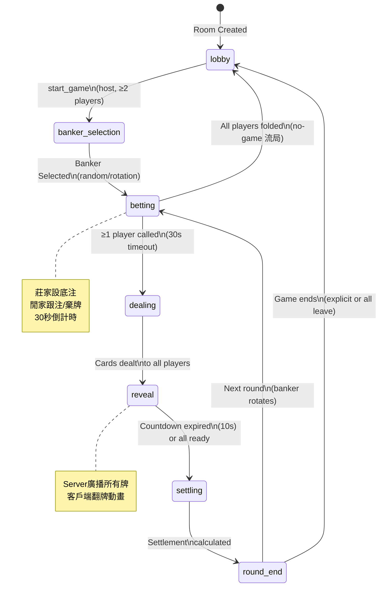
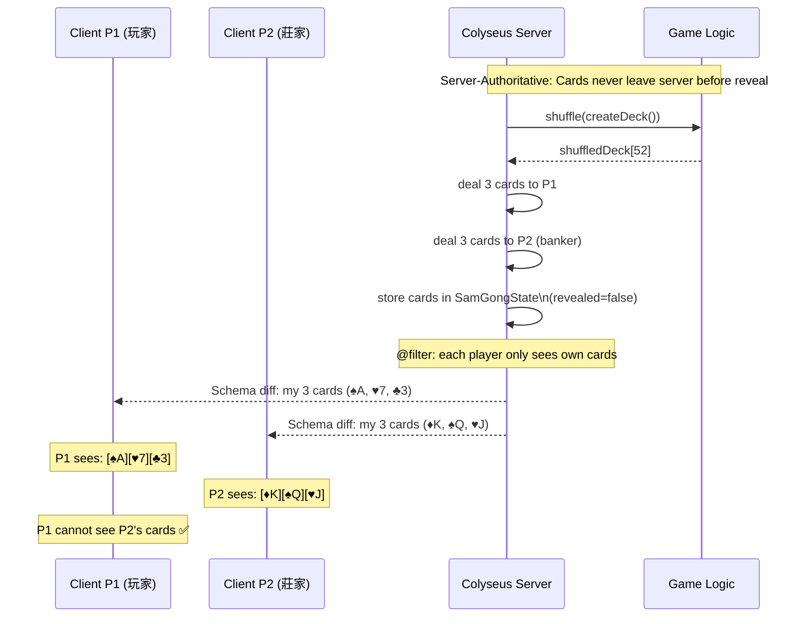
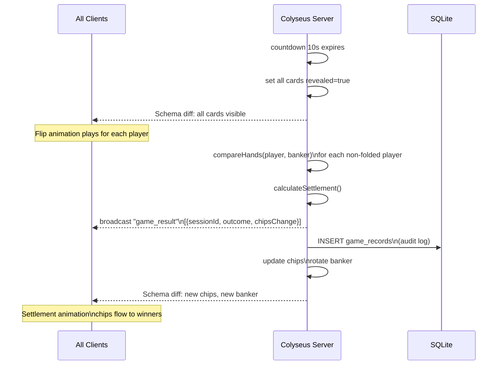
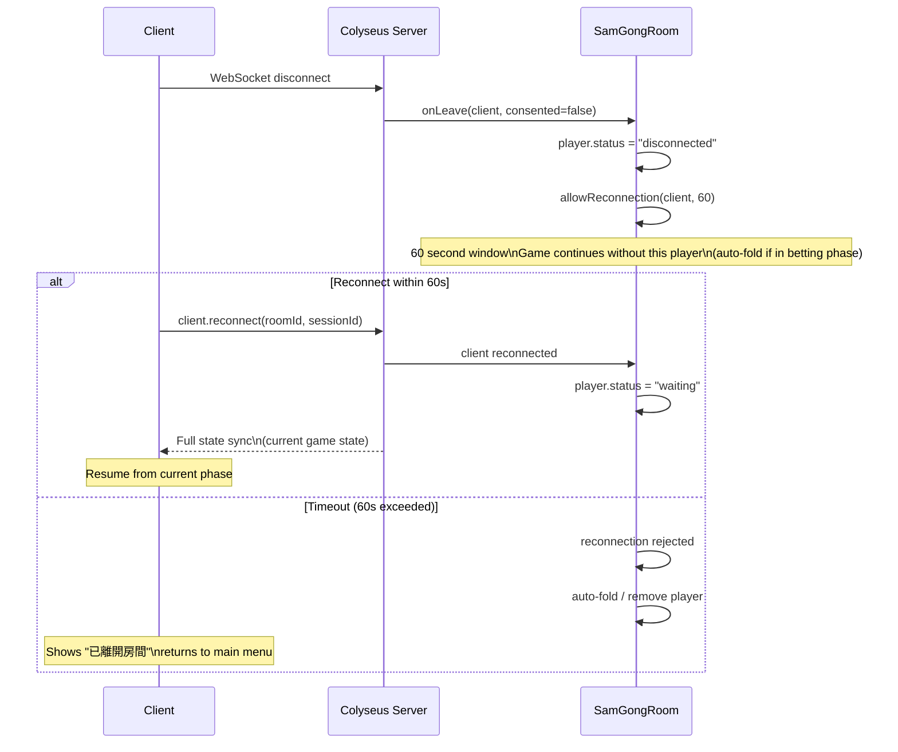
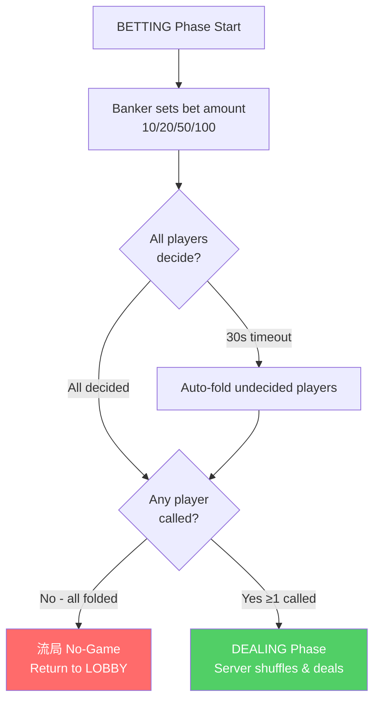
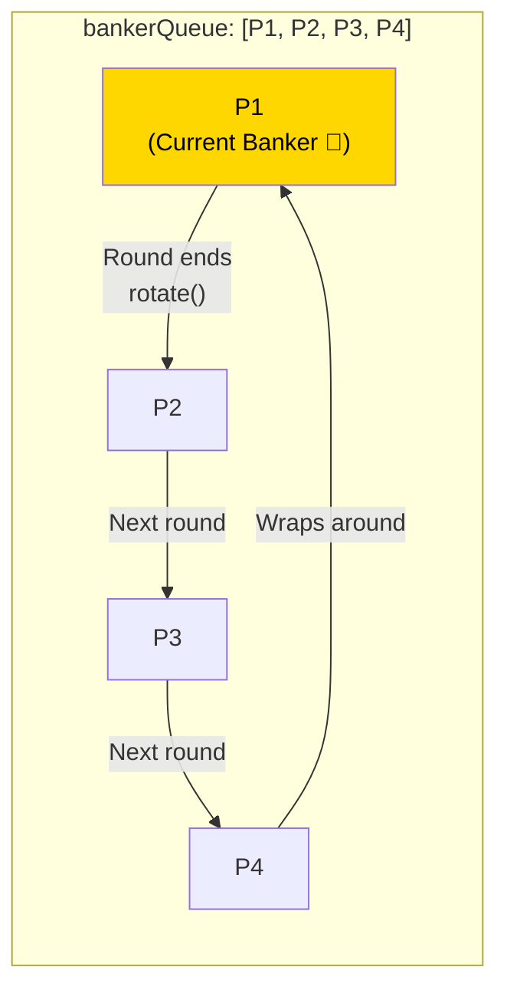
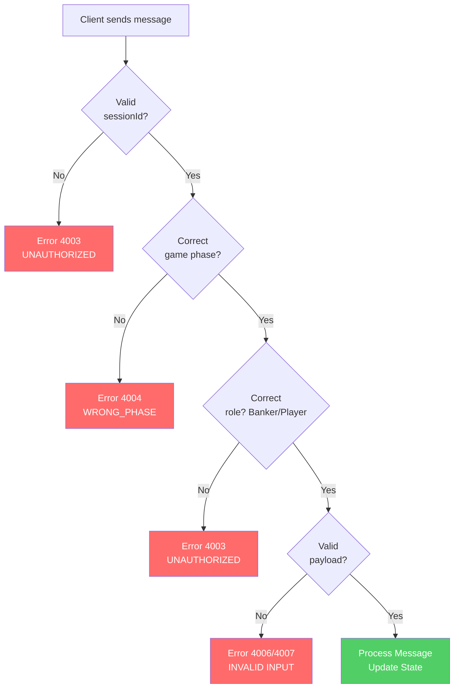
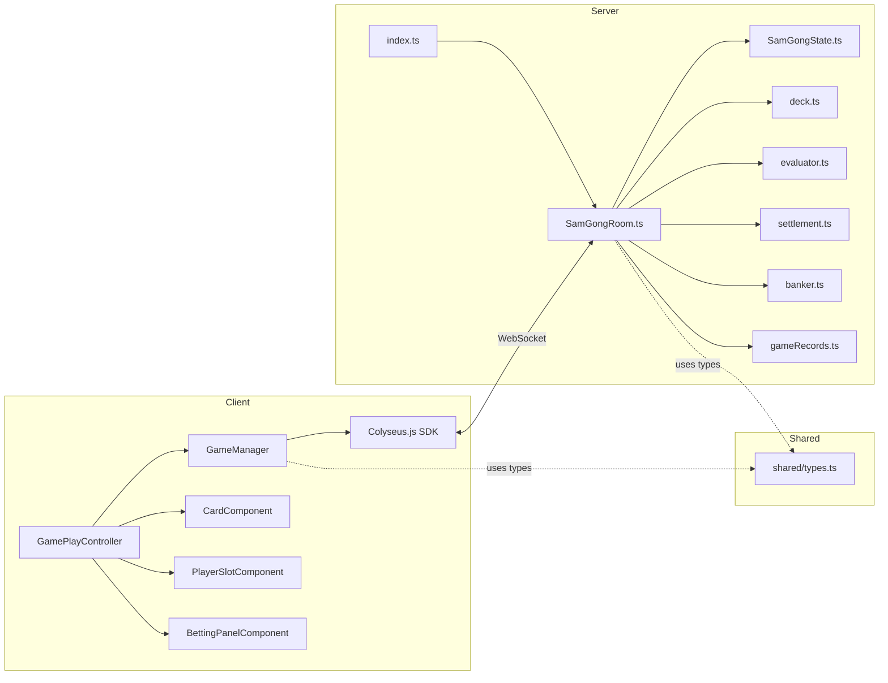

# DIAGRAMS — 三公遊戲 系統流程圖

## Document Control

| Field | Value |
|-------|-------|
| Version | v1.0 |
| Date | 2026-04-21 |
| Author | devsop-autodev STEP-13 |

---

## 1. System Architecture Diagram

```mermaid
graph TB
    subgraph Client["🎮 Cocos Creator Client (Web)"]
        GM[GameManager\nSingleton]
        GPC[GamePlayController]
        CC[CardComponent]
        PS[PlayerSlotComponent]
    end

    subgraph Server["⚙️ Colyseus Server (Node.js 20)"]
        ROOM[SamGongRoom]
        SM[State Machine]
        subgraph Logic["Game Logic (Pure Functions)"]
            DECK[deck.ts]
            EVAL[evaluator.ts]
            SETTLE[settlement.ts]
            BANKER[banker.ts]
        end
        SCHEMA[SamGongState\n@colyseus/schema]
    end

    subgraph Infra["🏗️ Infrastructure"]
        NGINX[Nginx\n:80/:443]
        SQLITE[(SQLite\nAudit Log)]
    end

    Browser -->|HTTP| NGINX
    Browser -->|WebSocket| NGINX
    NGINX -->|ws://| ROOM
    NGINX -->|static| Client
    GM <-->|Colyseus WS| ROOM
    ROOM --> SM
    SM --> Logic
    ROOM --> SCHEMA
    SCHEMA -->|Diff Sync| GM
    GM --> GPC
    GPC --> CC
    GPC --> PS
    ROOM -->|Audit| SQLITE
```

---

## 2. Game State Machine



---

## 3. Card Dealing Sequence (Anti-Cheat Critical)



---

## 4. Reveal & Settlement Sequence



---

## 5. Reconnection Flow



---

## 6. Betting Flow



---

## 7. Banker Rotation



---

## 8. Error Handling Flow



---

## 9. Component Dependency Graph


